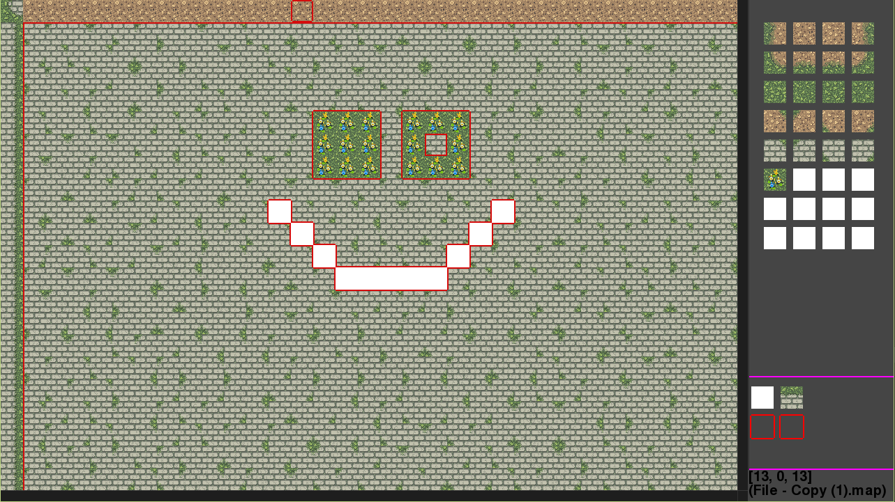
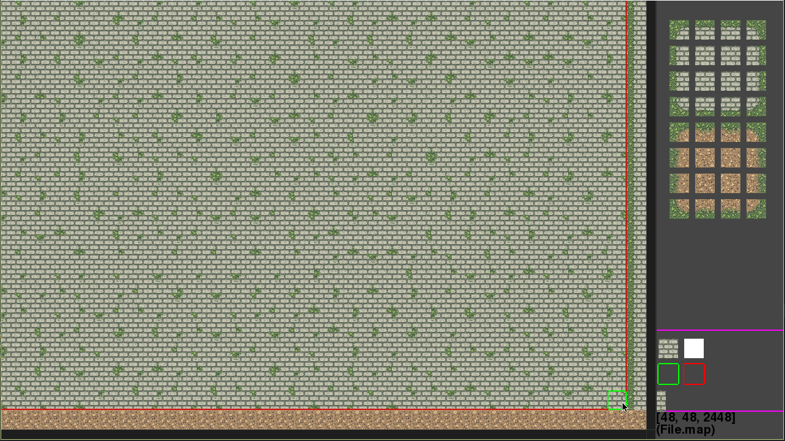

# Tileset-Editor
A Tileset Editor I wrote in 2012

Written with python 2.7 and pygame 1.9

##Controls
  Arrow keys to move the map around  
  'G' to toggle the grid  
  'C' to toggle rendering of colision bounds  
  'B' to move back a map  
  'Space' to save and move forward a map  
   
   
  Click on a tile on the right hand pane to set the current tile you're drawing with.  
  Left click maps the tile to the left mouse button.  
  Right click maps the tile to the right mouse button.  
  When focus is on the right pane you can use the up and down arrow keys to see more tiles.  
   
    
  In the box surrounded by a purple outline you can see the current tiles you have selected and the collision type you are drawing with 
  A green box mean you can pass through  
  A red box means the tile is collidable  
  You can click on the collision boxes to show change their type.
  
  This image shows collidable areas outlined in red, The available tiles on the right and your currently selected tiles left and right click respectively. Below that is their collision type and below that is various data.
  
  
